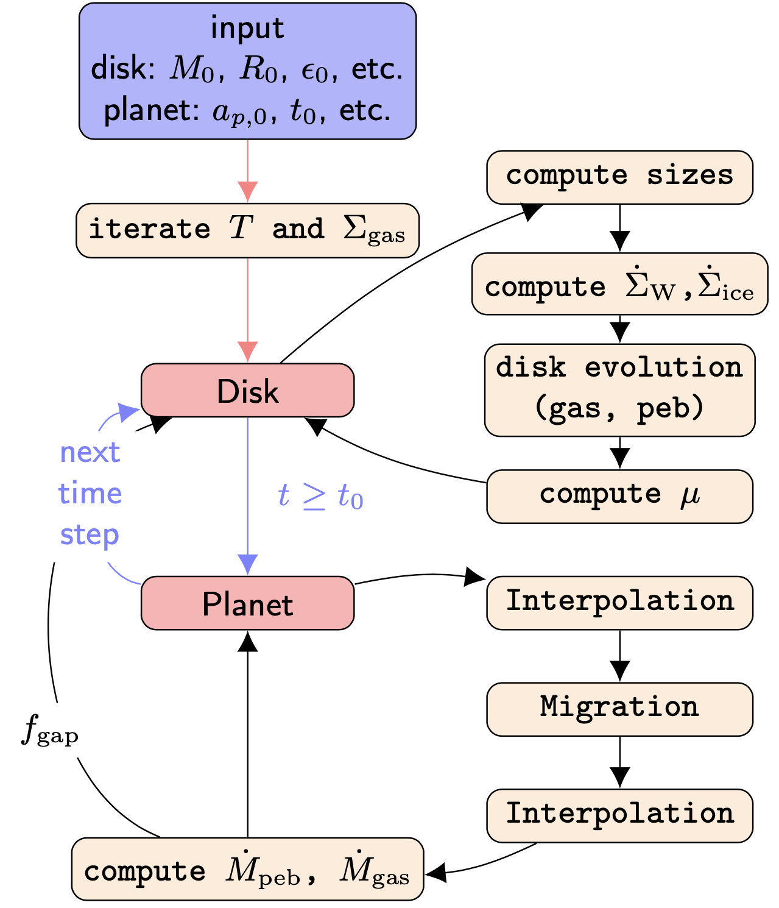

Operating Principle
-------------------

   Operating principle of ``chemcomp``. The main loop is shown in blue. Black arrows connect individual steps (beige nodes) that are performed in each time step. Red arrows indicate initialisation steps

``chemcomp`` provides a platform to simulate the above described physics. It includes a disk module (attributes are defined on a log-radial grid, can be changed in config file) that deals with the formation of pebbles and planetesimals as well as the dynamics of gas and pebbles. It calculates the temperature of the disk and the temperature dependent compositions of gas, pebbles and planetesimals by also including effects induced by the existance of evaporation lines.

.. Note:: Needs to be updated to be in line with paper version of code

The code also contains a planet module that handles growth and migration of a single planet. The planet module acts as the supervisor of the disk module and collects the matter available in the disk.

The operating principle of the code can also be divided into these two modules. Each time step begins with the calculation of the magnitude of the time step This is followed by the disk step. The disk step begins by computing the pebble growth and then computing the sink and source terms for the viscous evolution. We then have everything in place to evolve the surface densities in time. We use a modified version of the donor-cell scheme outlined in `Birnstiel et al. (2010) <https://ui.adsabs.harvard.edu/abs/2010A%26A...513A..79B/abstract>`_ to solve the viscous evolution and dust evolution for every molecular species. The realisation in `chemcomp` is an adapted version from the implementation in the unpublished code `DISKLAB`. This is then followed by the recomputation of the temperature.

We now have a disk that is advanced in time in which we calculate the torques acting on the planet by interpolating the disk quantities from the radial grid to its position and then advancing its position. After a next interpolation of the disk quantities to the new position of the planet, accretion rates for pebble accretion, planetesimal accretion and gas accretion, are calculated. The calculated accretion rates already include the chemical composition of the disk since surface densities are treated as vectors, meaning that the resulting accretion rates are also given as compositional vectors. These accretion rates are now added to the planets composition.
Accretion rates are additionally converted to sink terms that are then added to the viscous evolution for the next time step. For gas and pebbles we remove the matter from the gas and pebble surface density respectively. In case of pebble accretion we remove the accreted pebbles only from the cell where the planet is located, since we do not numerically resolve the hill sphere during pebble accretion. The accreted planetesimals are then explicitly removed from the planetesimal surface density
If the planet migrates to the inner edge of the protoplanetary disk, we stop the accretion of gas, because recycling flows penetrating into the hill sphere of the planet prevent efficient gas accretion. Finally, we also check whether the disk has disappeared (disk mass below 1e-6 solar masses). If both checks evaluated negative we start a new time step.

All disk quantities are defined on a logarithmically spaced grid with N=300 cells between r_in=0.1AU and r_out=5000AU (is set in config file). The code is initialised with the gas surface density. Followed by the knowledge of the solid to gas ratio DTG_total it computes the dust- and pebble surface densities. The code will then compute the temperature profile using the surface densities. In this paper we use the analytical solution for the gas surface density to initialise the code. Since this bases on the viscosity which depends on the temperature we iterate the above steps 100 times to ensure convergence of the initial conditions.
When the disk has been initialised the code may begin the viscous evolution. The planetary seed is then placed at t=t_0 into the disk.
