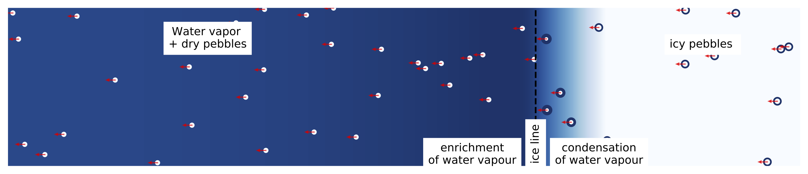
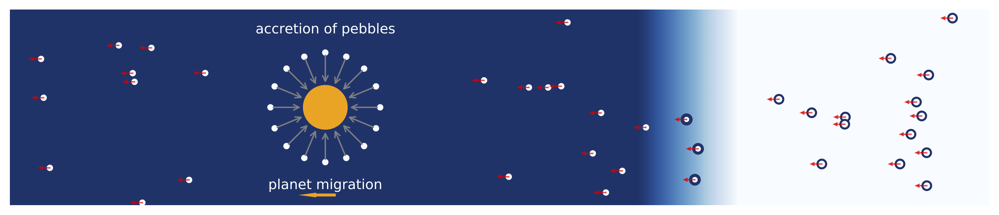
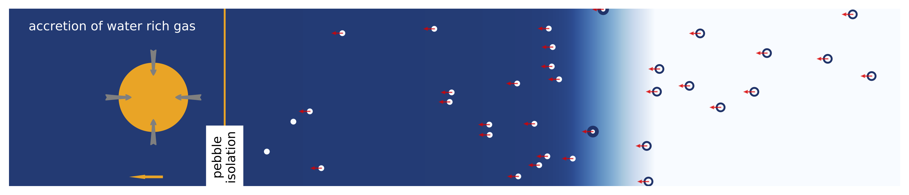

.. cubedsphere documentation master file, created by
   sphinx-quickstart on Mon Jan 11 14:18:49 2021.
   You can adapt this file completely to your liking, but it should at least
   contain the root `toctree` directive.

Welcome to chemcomp's documentation!
=======================================
Modeling the chemical composition of gas giants by accretion of pebbles and gas.
Before reading this documentation, please familiarise yourself with the following publications:

`Schneider & Bitsch (2021a) <https://ui.adsabs.harvard.edu/abs/2021arXiv210513267S/abstract>`_, `Schneider & Bitsch (2021b) <https://ui.adsabs.harvard.edu/abs/2021arXiv210903589S/abstract>`_

Capabilities
-------------
`chemcomp` is a python code that aims to enable the study the formation of planets in 1D protoplanetary disks.

Included disk physics:

* viscous disk evolution `(e.g. Lynden-Bell & Pringle 1974) <https://ui.adsabs.harvard.edu/abs/1974MNRAS.168..603L/abstract>`_
* pebble growth & evolution applying the two populations model `(Birnstiel et al. 2012) <https://ui.adsabs.harvard.edu/abs/2012A%26A...539A.148B/abstract>`_
* planetesimal formation `(Lenz et al. 2019) <https://ui.adsabs.harvard.edu/abs/2019ApJ...874...36L/abstract>`_ (outdated and not included in original paper)
* evaporation and condensation at evaporation lines `(Schneider & Bitsch 2021a) <https://ui.adsabs.harvard.edu/abs/2021arXiv210513267S/abstract>`_
* chemical compositions `(Schneider & Bitsch 2021a) <https://ui.adsabs.harvard.edu/abs/2021arXiv210513267S/abstract>`_

Included planet physics:

* type-I migration `(Paardekooper et al. 2011) <https://ui.adsabs.harvard.edu/abs/2011MNRAS.410..293P/abstract>`_
* type-II migration `(Kanagawa et al. 2018) <https://ui.adsabs.harvard.edu/abs/2018ApJ...861..140K/abstract>`_
* thermal torque `(Masset et al. 2017) <https://ui.adsabs.harvard.edu/abs/2017MNRAS.472.4204M/abstract>`_
* Dynamical torques `(Paardekooper et al. 2014) <https://ui.adsabs.harvard.edu/abs/2014MNRAS.444.2031P/abstract>`_
* Pebble Accretion `(Johansen & Lambrechts 2017) <https://ui.adsabs.harvard.edu/abs/2017AREPS..45..359J/abstract>`_
* Planetesimal Accretion `(Johansen & Bitsch 2019) <https://ui.adsabs.harvard.edu/abs/2019A%26A...631A..70J/abstract>`_ (outdated and not included in original paper)
* Gas accretion (`Machida et al. 2010 <https://ui.adsabs.harvard.edu/abs/2010MNRAS.405.1227M/abstract>`_, `Bitsch et al. 2015 <https://ui.adsabs.harvard.edu/abs/2015A%26A...582A.112B/abstract>`_, `Bergez-Casalou et al. 2020 <https://ui.adsabs.harvard.edu/abs/2020arXiv201000485B/abstract>`_)

   Phase 1: Dust particles grow to pebbles (small dots) and drift towards the star. Icy pebbles that cross the water ice line (dashed line) evaporate their water content and enrich the gas with water vapour. Water vapour that crosses the ice line condenses onto pebbles increasing their water content.

   Phase 2: The core of the planet is formed by pebble accretion while the planet migrates. Depending on the formation path, the core composition can be icy or dry.

   Phase 3: Once the planet is heavy enough to reach pebble isolation and form a pressure bump, pebbles are stoped and can not be accreted by the planet. The planet will then accrete water rich gas.

The physical model is in depth explained in `(Schneider & Bitsch 2021a) <https://ui.adsabs.harvard.edu/abs/2021arXiv210513267S/abstract>`_. This wiki is only meant for explanations on the structure of `chemcomp`.

.. note::
   Please contact me if you would like to get access to the code.

.. toctree::
   :maxdepth: 4
   :caption: Contents

   Installation
   Usage
   Operating-Principle
   File-Structure/File-Structure
   Object-Structure/Object-Structure
   Output
   FAQ

Indices and tables
==================

* :ref:`genindex`
* :ref:`search`

Copyright 2021 Aaron Schneider. Feel free to contact me for any questions via `mail <mailto:Aaron.Schneider@nbi.ku.dk>`_.
Do not publish any results obtained without consultation.
